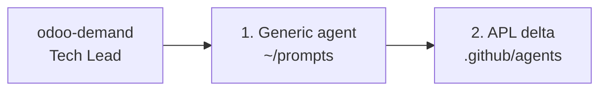

# `.github/` — Sous-équipe AI APL (extension de l'équipe générique Odoo)

Ce répertoire contient **toute la configuration AI versionnée** du projet : point
d'entrée Copilot, agents APL, skills, hooks et graphes Mermaid.

> **Principe directeur :** generic OCA agent first, then APL delta agent.
> Aucun agent APL ne duplique les conventions OCA — chacun se concentre sur ce qui
> diverge sur ce projet.

---

## Architecture à deux couches

```
~/.config/Code/User/prompts/             ← Équipe générique Odoo (par-développeur)
├── odoo-model.agent.md                  ⚙ OCA model conventions
├── odoo-test.agent.md                   🧪 OCA test conventions
├── odoo-view.agent.md                   🎨 XML views
├── odoo-wizard.agent.md                 🪄 TransientModel
├── odoo-security.agent.md               🔐 ACL & record rules
├── odoo-data.agent.md                   📦 XML/CSV data
├── odoo-report.agent.md                 📄 QWeb reports
├── odoo-precommit.agent.md              ✨ pre-commit / ruff / prettier
├── odoo-review.agent.md                 🔍 OCA review checklist
├── odoo-migration.agent.md              🚚 version upgrade
├── odoo-analyze.agent.md                📊 module analysis
├── odoo-debug.agent.md                  🐞 error diagnostics
└── odoo-scaffold.agent.md               🏗 new module skeleton

odoo-apl/.github/ (versionné, ce dépôt)  ← Sous-équipe APL
├── README.md                            ← Ce fichier
├── copilot-instructions.md              ← Point d'entrée Copilot
├── workflow.mmd                         ← Graphe Mermaid (compact)
├── workflow.legacy.mmd                  ← Graphe Mermaid (vue exhaustive)
├── workflow.interactions.mmd            ← Graphe Mermaid (vue par stockage)
│
├── agents/                              ← Spécialistes APL
│   ├── odoo-demand.agent.md             🤖 Tech Lead — orchestrateur 8 étapes
│   ├── odoo-uat-records.agent.md        🎥 QA — vidéos MP4 (utilise uat_records/)
│   ├── odoo-api.agent.md                🔌 apl_api_* / FastAPI / GraphQL / Topmotive
│   ├── apl-patterns.agent.md            🧬 Delta modèles : route rules, consigne, pricing, UUID, groups
│   ├── apl-test.agent.md                🧪 Delta tests : odootest, fixtures APL, route/consigne/auth_api_key
│   └── apl-review.agent.md              🛡 Checklist APL en complément de odoo-review
│
├── skills/                              ← Workflows à la demande
│   ├── demand_analysis/SKILL.md         📐 Estimation <USER ESTIMATE>
│   └── onboarding/SKILL.md              🚀 Découverte projet
│
├── prompts/                             ← Slash-commands chat (/user-*)
│   ├── user-demand.prompt.md            ▶ injecte <USER DEMAND>
│   ├── user-estimate.prompt.md          ▶ injecte <USER ESTIMATE>
│   ├── user-review.prompt.md            ▶ injecte <USER REVIEW>
│   ├── user-refactor.prompt.md          ▶ injecte <USER REFACTOR>
│   └── user-fix.prompt.md               ▶ injecte <USER FIX>
│
└── hooks/                               ← Enforcement déterministe
    ├── pre-commit-enforce.json          ⚙️ PostToolUse → pre-commit
    └── scripts/pre-commit-on-edit.sh
```

---

## Couches et délégation

Chaque tâche métier suit le pattern **2-couches** :



| Tâche | Couche 1 — générique | Couche 2 — APL delta |
|-------|----------------------|----------------------|
| Modèle | `odoo-model` | `apl-patterns` |
| Test | `odoo-test` | `apl-test` |
| Review | `odoo-review` | `apl-review` |
| Pre-commit | `odoo-precommit` | _(pas de delta)_ |
| Views / Wizard / Security / Data / Report / Migration | dédié | _(pas de delta)_ |
| API (FastAPI / Topmotive) | _(direct APL)_ | `odoo-api` |
| Vidéo UAT | _(direct APL)_ | `odoo-uat-records` |

**Règle :** ne JAMAIS invoquer un agent APL sans avoir d'abord exécuté le générique
correspondant. L'orchestration est la responsabilité de `odoo-demand`.

---

## Graphes des interactions

> Squelette générique réutilisable :
> `~/.config/Code/User/prompts/odoo-team-skeleton.mmd`. Les graphes ci-dessous
> sont la spécialisation APL (placeholders `<project>` remplacés par les agents
> concrets).

- [`workflow.mmd`](./workflow.mmd) — vue compacte (TB)
- [`workflow.legacy.mmd`](./workflow.legacy.mmd) — vue exhaustive (LR)
- [`workflow.interactions.mmd`](./workflow.interactions.mmd) — vue par stockage (4 zones)

---

## Comment fonctionne l'équipe

### 1. Point d'entrée : `copilot-instructions.md`

Chargé **automatiquement** à chaque interaction. Définit :
- Les règles MANDATORY (`odootest`, pre-commit, seuils qualité)
- Les déclencheurs `<USER DEMAND>` → `odoo-demand`, `<USER ESTIMATE>` → `demand_analysis`
- La liste des instructions user-level à charger

### 2. Découverte par Copilot

VS Code Copilot scrute directement `.github/agents/`, `.github/skills/`,
`.github/hooks/`. Tout fichier ajouté est immédiatement disponible — pas de
symlink, pas d'indirection.

### 3. Skills vs Agents

| Critère | Skill | Agent |
| ------- | ----- | ----- |
| Invocation | Slash command ou trigger auto | `runSubagent("nom", ...)` |
| Contexte | Hérite du contexte courant | Isolé |
| Retour | Continue la conversation | Message final unique |
| Usage | Workflow lourd ponctuel | Tâche spécialisée déléguée |

### 4. Hooks

Déterministes. Le hook actuel (`pre-commit-enforce`) exécute `pre-commit run
--files` après chaque édition de `.py` / `.xml`.

---

## Déclencheurs

| Mot-clé / situation | Primitive activée |
| ------------------- | ----------------- |
| `<USER DEMAND>` | Agent `odoo-demand` (workflow 8 étapes) |
| `<USER ESTIMATE>` | Skill `demand_analysis` |
| `<USER REVIEW>` | Chaîne `odoo-review` → `apl-review` (read-only) |
| `<USER REFACTOR>` | Agent `odoo-demand` mode refactor (branches chaînées) |
| `<USER FIX>` | Agent `odoo-fix` (édition code existant uniquement) |
| `onboarding`, `getting started`, `découverte` | Skill `onboarding` |
| `video`, `MP4`, `recording`, `UAT` | Agent `odoo-uat-records` |
| `api`, `fastapi`, `graphql`, `topmotive` | Agent `odoo-api` |
| `route rule`, `consigne`, `apl_sale_line_price`, `customer group`, `apl uuid` | Agent `apl-patterns` |
| `apl test`, `odootest`, `auth_api_key` | Agent `apl-test` |
| `apl review`, `convention audit` | Agent `apl-review` |
| Édition `.py` ou `.xml` | Hook `pre-commit-enforce` |

---

## Setup pour un nouveau développeur

L'équipe générique Odoo vit dans `~/.config/Code/User/prompts/` (par-développeur,
non versionné). Un nouveau dev doit installer ces fichiers séparément. Voir le
skill `onboarding` pour les instructions de setup.

---

## Ajouter un agent / skill / hook

### Ajouter un agent APL
1. Vérifier qu'aucun agent générique ne couvre déjà 100% du besoin
2. Créer `.github/agents/<nom>.agent.md` avec frontmatter YAML (`description`, `tools`)
3. Décrire **uniquement le delta APL** — référencer l'agent générique correspondant
4. Mettre à jour `odoo-demand` si l'agent intervient dans le workflow 8-étapes
5. Tester : taper le mot-clé déclencheur dans le chat

### Ajouter un skill
1. Créer `.github/skills/<nom>/SKILL.md` avec frontmatter (`name` = nom du dossier)
2. La `description` doit contenir les mots-clés de découverte
3. Tester : `/` dans le chat doit lister le skill

### Ajouter un hook
1. Créer `.github/hooks/<nom>.json` (un fichier par hook)
2. Mettre le script dans `.github/hooks/scripts/` avec `chmod +x`
3. Tester en déclenchant l'événement

---

## Conventions et bonnes pratiques

1. **Pas de duplication générique** — un agent APL qui répète des conventions
   OCA est un bug. Refactorer pour ne garder que le delta.

2. **Descriptions riches en mots-clés APL** — préfixer par "APL" ou mentionner
   les modules `apl_*` concernés pour éviter la collision avec l'agent générique.

3. **`applyTo: "**"` est coûteux** — n'utiliser que pour les instructions vraiment
   universelles (cas de `general.instructions.md`).

4. **Pas de logique métier dans les hooks** — un hook fait UNE chose déterministe.

5. **YAML frontmatter** — quoter les valeurs contenant `:` :
   `description: "Use when: doing X"`.

6. **Versionner via git** — `.github/` est tracké, contrairement aux agents
   user-level. Toute modification passe en review.
